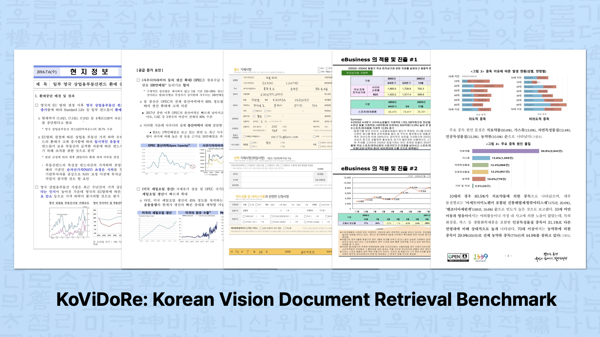
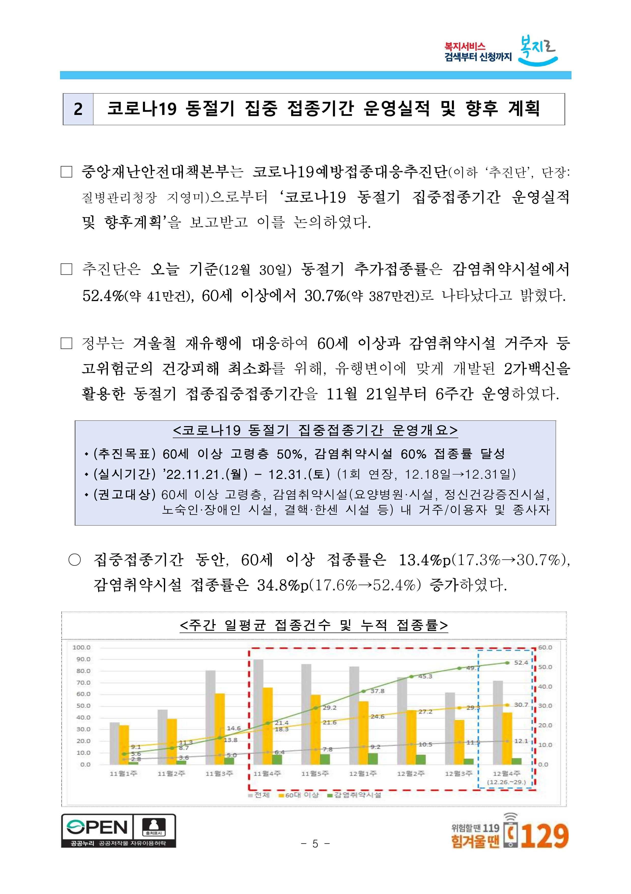
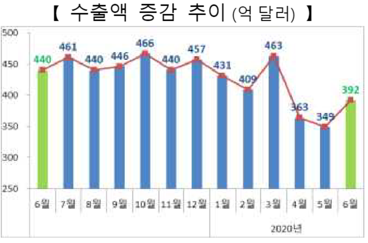
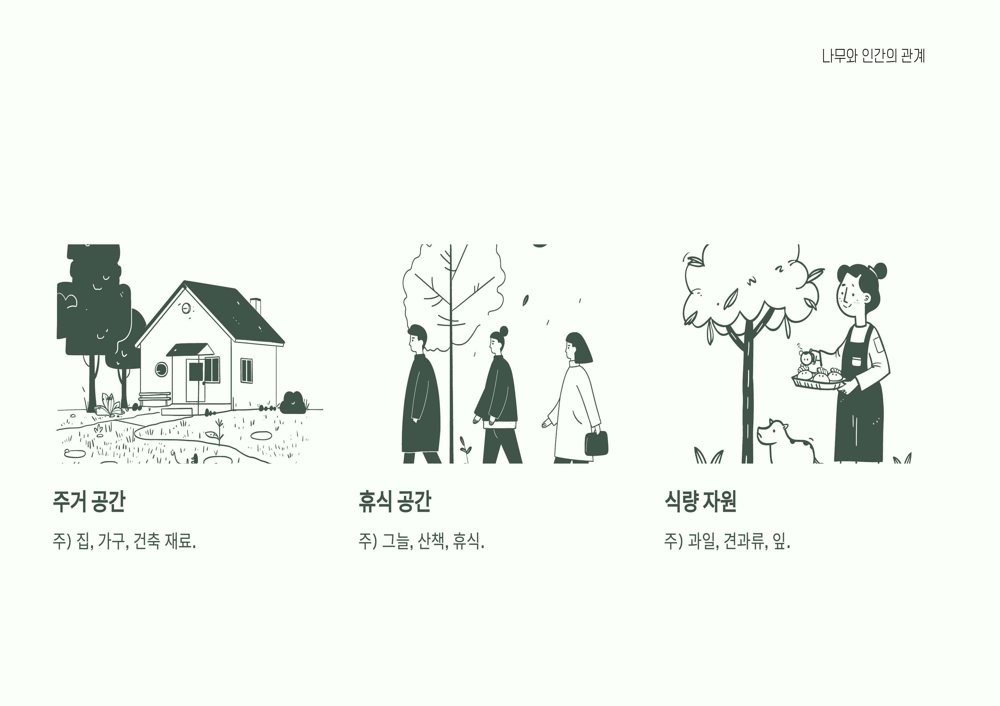
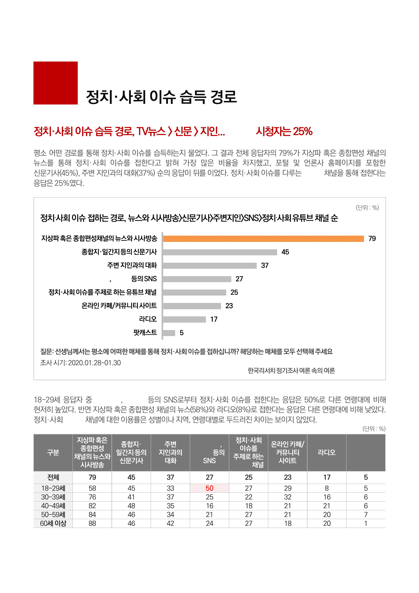
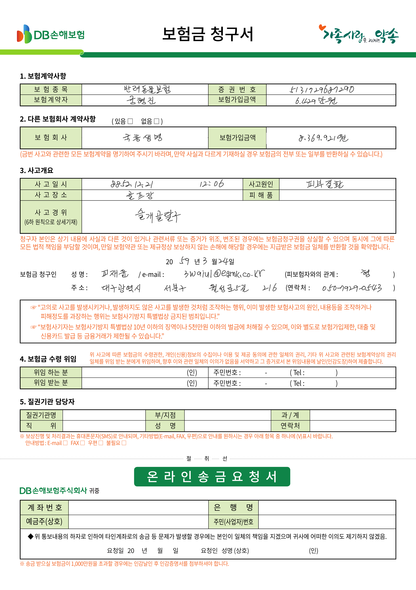

# KoVidore Benchmark

Korean Vision Document Retrieval (KoVidore) benchmark for evaluating text-to-image retrieval models on Korean visual documents.

## Overview


KoVidore is a comprehensive benchmark for evaluating Korean visual document retrieval capabilities. Built upon the foundation of [ViDoRe](https://github.com/illuin-tech/vidore-benchmark), it assesses how well models can retrieve relevant Korean visual documents—including screenshots, presentation slides, and office documents—when given Korean text queries.

The benchmark encompasses 5 distinct tasks, each targeting different types of visual documents commonly found in Korean business and academic environments. This diverse task structure allows for thorough evaluation of multimodal retrieval performance across various document formats and content types.

## Tasks & Examples

| Task | Description | Documents | Queries | Example Query | Sample Image |
|------|-------------|-----------|---------|---------------|--------------|
| **MIR** | Multimodal Information Retrieval | 1,366 | 1,496 | 코로나19 동절기 집중접종기간 운영개요 혼합형에 대해 알려주세요 |  |
| **VQA** | Visual Question Answering | 1,101 | 1,500 | 경제협력 품목 중 가장 적은 교역액과 가장 많은 교역액의 차이는 얼마인가요? |  |
| **Slide** | Presentation Slides | 1,415 | 180 | 포털 사이트나 콘텐츠 제공자가 기존 콘텐츠를 다양한 장치로 서비스할 때 얻는 이점은 무엇인가? |  |
| **Office** | Office Documents | 1,993 | 222 | 정치·사회 이슈를 주제로 하는 유튜브 채널을 통해 정보를 얻는 비율은 얼마인가요? |  |
| **FinOCR** | Financial OCR Documents | 2,000 | 198 | 반려동물보험에 가입한 보험계약자 공형진의 증권번호는 무엇인가요? |  |

## Performance Leaderboard

The following table shows NDCG@5 performance across all KoVidore tasks:

| Model | Size (M) | MIR | VQA | Slide | Office | FinOCR | ViDoRe v2 (English) |
|-------|----------|-----|-----|-------|--------|--------|--------|
| **CLIP-ViT-bigG-14** | 2540 | 0.02015 | 0.0561 | 0.12331 | 0.03929 | 0 | 17.6 |
| **Nomic Embed Multimodal 3B** | 3000 | 0.68499 | 0.84348 | 0.80148 | 0.85679 | 0.87196 | TBA |
| **ColPali v1.3** | 2920 | 0.18125 | 0.36716 | 0.55297 | 0.25889 | 0.37437 | 54.2 |
| **ColQwen2 v1.0** | 2540 | 0.53614 | 0.75765 | 0.74257 | 0.66598 | 0.67542 | TBA |
| **ColQwen2.5 v0.2** | 3000 | 0.6028 | 0.8095 | 0.79074 | 0.76099 | 0.7472 | TBA |
| **SigLIP Large 384** | 878 | 0.03186 | 0.07397 | 0.19783 | 0.053 | 0.00975 | TBA |
| **Jina Embeddings v4** | 3800 | 0.71824 | 0.86245 | TBA | TBA | 0.88922 | TBA |

*TBA: To Be Announced - Results will be updated as evaluations are completed.*

## Installation

```bash
# Install dependencies
uv sync

# Install the package in editable mode
uv pip install -e .
```

## Quick Start

### Using the CLI

```bash

# Run with custom model
uv run kovidore --model "your-model-name"

# Run specific tasks
uv run kovidore --model "your-model-name" --tasks mir vqa

# Run with custom batch size (default: 16)
uv run kovidore --model "your-model-name" --batch-size 32

# List available tasks
uv run kovidore --list-tasks
```

### Using as a Library

```python
from src.evaluate import run_benchmark

# Run all tasks
evaluation = run_benchmark("your-model-name")

# Run specific tasks
evaluation = run_benchmark("your-model-name", tasks=["mir", "vqa"])

# Run with custom batch size
evaluation = run_benchmark("your-model-name", batch_size=32)
```

## Datasets

We provide pre-processed queries and query-corpus mappings for each task. However, due to licensing restrictions, you'll need to download the image datasets manually from AI Hub (see Acknowledgements section for dataset links).

**Setup Instructions:**
1. Download the required datasets from AI Hub
2. Extract and place images in the following directory structure:
    ```
    data/
    ├── mir/images/
    ├── vqa/images/
    ├── slide/images/
    ├── office/images/
    └── finocr/images/
    ```

The benchmark will automatically locate and use the images from these directories during evaluation.

## Results

Results are automatically saved in the `results/` directory after evaluation completion. The benchmark uses NDCG@5 as the main evaluation metric for all tasks.

## Acknowledgements

This benchmark is inspired by the [ViDoRe](https://github.com/illuin-tech/vidore-benchmark) benchmark. We thank the original authors for their foundational work that helped shape our approach to Korean visual document retrieval.

We also acknowledge the following Korean datasets from AI Hub that were used to construct each task in KoVidore:

- **[멀티모달 정보검색 데이터](https://aihub.or.kr/aihubdata/data/view.do?currMenu=115&topMenu=100&dataSetSn=71813)** - Used for KoVidoreMIRRetrieval task
- **[시각화 자료 질의응답 데이터](https://aihub.or.kr/aihubdata/data/view.do?currMenu=115&topMenu=100&dataSetSn=71812)** - Used for KoVidoreVQARetrieval task  
- **[오피스 문서 생성 데이터](https://www.aihub.or.kr/aihubdata/data/view.do?currMenu=115&topMenu=100&dataSetSn=71811)** - Used for KoVidoreSlideRetrieval and KoVidoreOfficeRetrieval tasks
- **[OCR 데이터(금융 및 물류)](https://www.aihub.or.kr/aihubdata/data/view.do?currMenu=115&topMenu=100&dataSetSn=71301)** - Used for KoVidoreFinOCRRetrieval task

## Contact

For questions or suggestions, please open an issue on the GitHub repository or contact the maintainers:

- [Yongbin Choi](https://github.com/whybe-choi) - whybe.choi@gmail.com
- [Yongwoo Song](https://github.com/facerain) - syw5141@khu.ac.kr
